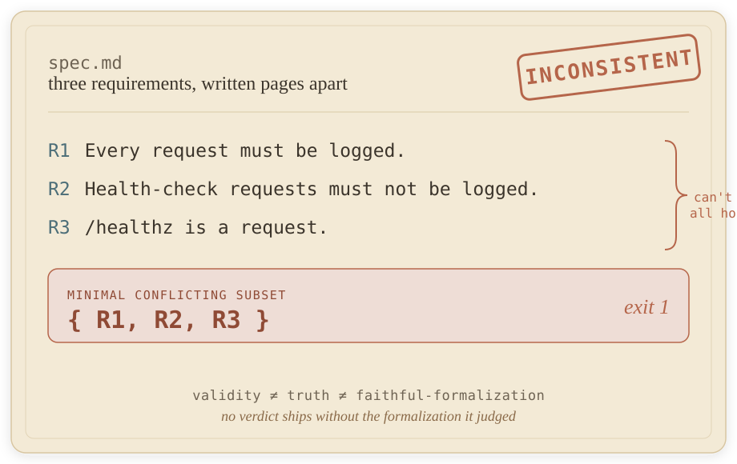
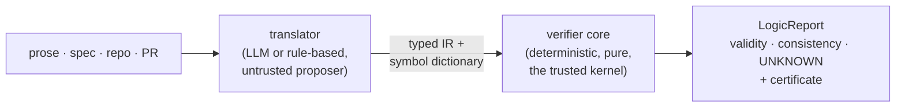

<div align="center">


<p>
  <a href="https://github.com/barmoshe/entailer/actions/workflows/ci.yml"></a>
  <a href="https://www.npmjs.com/package/@entailer/core"></a>
  <a href="https://www.npmjs.com/package/@entailer/core"></a>
  <a href="./LICENSE"></a>
</p>

<p>
  <b><a href="https://barmoshe.github.io/entailer/#/playground">Playground</a></b> &nbsp;·&nbsp;
  <a href="https://barmoshe.github.io/entailer/">Live site</a> &nbsp;·&nbsp;
  <a href="https://www.npmjs.com/org/entailer">npm</a> &nbsp;·&nbsp;
  <a href="./DESIGN.md">Design</a> &nbsp;·&nbsp;
  <a href="./CHANGELOG.md">Changelog</a> &nbsp;·&nbsp;
  <a href="./examples">Examples</a>
</p>

</div>

---

**A logician's-pass linter for software artifacts.** Entailer checks whether prose
that argues actually *follows*, and whether a set of requirements is *consistent*, by
formalizing the load-bearing claims into logic and verifying them deterministically.
It reports **validity** and **consistency** separately from **truth**, and it never
ships a verdict without showing the formalization it judged.

Think "markdownlint or Vale, but for logical validity and consistency," running over
claims, prompts, docs, and whole repos.

## Contents

- [The example that matters](#the-example-that-matters)
- [Try it live](#try-it-live)
- [What is honest about it](#what-is-honest-about-it)
- [Architecture](#architecture)
- [The five tiers](#the-five-tiers)
- [The concept-faithfulness lens](#the-concept-faithfulness-lens)
- [Packages](#packages)
- [Editors and agents](#editors-and-agents)
- [Examples](#examples)
- [Develop](#develop)
- [Roadmap](#roadmap)
- [Contributing](#contributing) · [License](#license)

## The example that matters

A linter for *style* cannot catch this. Two requirements in a spec, written pages
apart, that cannot both hold:

```
R1. Every request must be logged.
R2. Health-check requests must not be logged.
R3. /healthz is a request.
```

These three are mutually inconsistent: R3 makes `/healthz` a request, R1 forces it to
be logged, R2 forbids it. Entailer surfaces that as an `INCONSISTENT` verdict with the
**minimal conflicting subset** `{R1, R2, R3}`, not a vibe and not a style nag. A
cross-file contradiction like this is the thing a single-sentence "is this a fallacy"
toy structurally cannot produce, and Tiers 3 and 4 catch it across a document or a
whole repository.

<div align="center">
  
</div>

## Try it live

The [**Playground**](https://barmoshe.github.io/entailer/#/playground) runs the real
`@entailer/core` in your browser: live truth tables, counter-models, and the
markdown/domain checkers with no install.

```sh
# CLI (no install)
npx @entailer/cli markdown spec.md              # Tier 3: within-doc consistency
npx @entailer/cli repo .                         # Tier 4: cross-file consistency
npx @entailer/cli pr 42                           # Tier 5: base to head delta over PR #42 (gh + git)
npx @entailer/cli pr --base main                  # Tier 5: working tree vs a local git ref
npx @entailer/cli sentence "a -> a"               # Tier 1: classify a claim
npx @entailer/cli check --ir argument.json        # validity of a supplied argument
npx @entailer/cli domain --lens access.yaml --repo .   # Lens: concept faithfulness (not a tier)
```

```ts
// Library
import { evaluateMarkdown } from "@entailer/core";

const report = evaluateMarkdown({ markdown, uri: "spec.md" });
console.log(report.verdict, report.consistency.minimalConflictingSubset);
```

Exit codes: `0` no issue / valid, `1` invalid or inconsistent, `2` malformed input,
`3` UNKNOWN-blocked. Runnable demos live in [`examples/`](./examples).

## What is honest about it

The whole tool exists to protect one distinction:

> **validity ≠ truth ≠ faithful-formalization**: three independent fields, never collapsed.

- **Validity / consistency** is what the deterministic core licenses (`Γ ∪ {¬φ}`
  unsatisfiable means valid; a witnessed model means invalid or consistent). It is
  sound by construction and reproducible.
- **Faithfulness** (does the formula capture the English?) is attestable only by a
  human or an LLM in the loop. It is the weak link, so the formalization is *always
  shown*. A verdict with no visible symbol dictionary fails schema validation; it
  cannot ship.
- **Premise truth** is a question about the world and is explicitly out of scope.

There is no "soundness score." `unknown` / out-of-fragment / timeout is a first-class
`UNKNOWN` verdict, never silently `VALID` or `INVALID`.

## Architecture

A strict two-layer split. A pluggable **translator** (LLM-in-the-loop or rule-based)
emits a typed **IR** carrying an auditable symbol dictionary. A fully deterministic
**verifier core** consumes *only the IR, never raw text*, so the same checker runs
identically whether a human or a model produced the formalization.



Logic lives in exactly one place: `@entailer/core` (pure TypeScript, zero LLM or
solver dependencies). See [`DESIGN.md`](./DESIGN.md) for the full pipeline, IR schema,
tier model, and milestone plan.

## The five tiers

Every tier runs over the **one** deterministic core. The IR and source-adapter seam is
what lets each tier extend the same checker instead of re-implementing logic.

| Tier | Input | Status |
|------|-------|--------|
| **1 · Sentence** | one claim | Built ✅ |
| **2 · Prompt** | prose with an implicit conclusion | Built ✅ |
| **3 · Markdown** | one `.md` | Built ✅ |
| **4 · Repo** | a path, cross-file | Built ✅ |
| **5 · PR** | base + head file sets (+ PR body) | Built ✅, base→head delta / regression gate |

Tier 5 is a **regression gate**: it diffs the base claim-set against the head, attributes
each contradiction as introduced / fixed / pre-existing, and (under `--gate introduced`)
fails only on what a change *newly* breaks. An inconsistent-but-not-regressed head passes
honestly. The deterministic core takes the formalization as supplied input; the LLM
translator ([`@entailer/translate`](./packages/translate)) produces it from prose and
degrades to `UNKNOWN` when the translation is shaky.

## The concept-faithfulness lens

The five tiers ask *does the logic hold?* The **domain lens** asks a different question
on a different axis: *does the code stay faithful to its own concepts?* You declare a
small concept cluster on its four sides (relationships, a defining rule, examples, and
vocabulary), and the lens flags where a codebase drifts from it.

```yaml
# access.yaml: a concept cluster
cluster: access
boundary: ["src/**"]
concepts:
  - concept: member
    vocabulary: [member, subscriber]
  - concept: guest
    vocabulary: [guest, anonymous]
relationships:
  - member is-not guest   # declared mutually exclusive
```

```sh
npx @entailer/cli domain --lens access.yaml --repo .
# ⛔ concept-fusion  src/access.ts:1  identifier `grantMemberGuest` names both
#    `member` and `guest`, which the cluster declares mutually exclusive.  exit 1
```

It is honest the same way the tiers are. Only a **rank-1** finding is a *verdict*: a
deterministic contradiction, one identifier fusing two `is-not` concepts, or a
self-contradictory declaration (caught before any file is read). **Ranks 2–3 are reader
hints**, they assert nothing, can never block, and never render as a certificate,
enforced by the `DomainReport` schema. An `is-a` overlap (a `member` that *is* a `user`)
is satisfiable by construction, so it stays silent, no false positive. The one weak link,
classification ("is this token a `member`-use?"), is lexical and named as such: a human
confirms each site. `--gate introduced` reports only leaks new versus a base ref. Also
available as the MCP tool `evaluate_domain`.

## Packages

All six publish together and are live on npm. `@entailer/core` is the only one you need
to check a supplied formalization.

| Package | Role | npm |
|---------|------|-----|
| [**@entailer/core**](./packages/core) | The trusted kernel: Formula AST, DSL parser, propositional tableau + DPLL, classification, the IR, and the `LogicReport` schema. Pure, dependency-light. | [](https://www.npmjs.com/package/@entailer/core) |
| [**@entailer/cli**](./packages/cli) | The `entailer` binary: evaluate a formalization, `--json` output, honest exit codes including a distinct `UNKNOWN`-blocked code. | [](https://www.npmjs.com/package/@entailer/cli) |
| [**@entailer/mcp**](./packages/mcp) | Stdio MCP server exposing the deterministic `check_*` / `classify` / `evaluate_*` tools with structured output. Stateless; the caller formalizes in-context, then calls a tool. | [](https://www.npmjs.com/package/@entailer/mcp) |
| [**@entailer/translate**](./packages/translate) | The **autonomous** LLM seam, the *only* package that touches a model. For scripts and CI **outside an editor**: turns prose into the typed IR via Claude (bring your own `ANTHROPIC_API_KEY`), then the core verifies it. A parse failure or undeclared atom forces `UNKNOWN` over a confident-but-wrong verdict. The formalizer is injectable, so the engine is fully testable offline. **From Claude Code / Codex you don't need this package or a key** — the plugin formalizes in-context. | [](https://www.npmjs.com/package/@entailer/translate) |
| [**@entailer/viz**](./packages/viz) | Deterministic visualizers: typed view-models plus dependency-free text / SVG / Mermaid renderers. Colors a verdict only when its certificate (proof or counter-model) is present, so a picture can never launder a hint into a verdict. | [](https://www.npmjs.com/package/@entailer/viz) |
| [**@entailer/solver**](./packages/solver) | Opt-in SMT escalation: a pure SMT-LIB emitter plus a lazily-probed Z3 backend that degrades to `UNKNOWN` when `z3-solver` is absent. An amplifier, never a gate. | [](https://www.npmjs.com/package/@entailer/solver) |

## Editors and agents

Entailer ships an MCP server plus two editor plugins, so an agent can call the
deterministic checker directly. **From an editor this is fully key-less:** the agent
*is* the model, so it formalizes prose in-context (no `ANTHROPIC_API_KEY`, no network,
no `@entailer/translate`) and then calls the deterministic tools for the verdict. The
key-carrying [`@entailer/translate`](./packages/translate) is only for autonomous use
*outside* an editor.

- **MCP server**: `npx @entailer/mcp` (declared in [`plugin/.mcp.json`](./plugin/.mcp.json)).
  Exposes `check_validity`, `check_consistency`, `classify_formula`, `evaluate_sentence`,
  `evaluate_argument`, `evaluate_prompt`, `evaluate_markdown`, `evaluate_repo`,
  `evaluate_pull_request`, and `evaluate_domain`.
- **Claude Code plugin**: in [`plugin/`](./plugin) — an MCP server plus a `formalize` skill
  that formalizes in-context and then runs a real deterministic check (MCP tools or the CLI).
- **Codex plugin**: in [`codex/`](./codex), the same server and skill via `npx -y @entailer/mcp`.

<details>
<summary>Why an MCP tool instead of "just ask the model"?</summary>

The model is a good *translator* and a poor *verifier*. The MCP path keeps that split:
the agent formalizes in-context (the untrusted step, always shown) and the deterministic
core decides validity/consistency (the trusted step, reproducible). The tool returns a
structured `LogicReport` whose honesty invariants are schema-enforced, so a confident
hallucinated "VALID" cannot come back without the proof that licenses it.

</details>

## Examples

Runnable, no keys required, in [`examples/`](./examples):

| Command | Shows |
|---------|-------|
| `check --ir examples/affirming-consequent.ir.json` | Tier 2: `INVALID`, counter-model `p=F, q=T` |
| `markdown examples/inconsistent-spec.md` | Tier 3: within-doc contradiction, back to path:line |
| `repo examples/repo-demo` | Tier 4: cross-file conflict spanning README and SPEC |
| `domain --lens examples/domain-lens/access.yaml --repo examples/domain-lens` | Lens: a rank-1 `concept-fusion` leak |
| `node examples/programmatic.mjs` | The library API across sentence / argument / markdown / repo |

## Develop

```sh
pnpm install
pnpm check        # build + typecheck + every test suite + the drift gate
```

Requires Node `>=20.19` and pnpm; built with pnpm workspaces and TypeScript. CI runs the
same `pnpm check` on every push ([ci.yml](./.github/workflows/ci.yml)).

`pnpm check` is the full local gate. The [`formalize`](./plugin/skills/formalize) skill is
vendored one-way via `pnpm vendor:skill`, and the machine-readable taxonomy is generated
from its references (`pnpm gen`), never hand-copied; the gate fails on any drift.

## Roadmap

Shipped: the deterministic core, all five tiers, the concept-faithfulness lens, six
published packages, an MCP server, two editor plugins, and a live playground. Deferred
(designed, not yet wired):

- the LLM-grounded **rank-3 prose-vs-practice** detector on the domain lens,
- **execution-grounded** leak detection (beyond lexical classification),
- the standing-rule **adjudication write-back** loop.

See [`CHANGELOG.md`](./CHANGELOG.md) for the release history.

## Contributing

Issues and PRs are welcome. Please read [`CONTRIBUTING.md`](./CONTRIBUTING.md) and the
[`CODE_OF_CONDUCT.md`](./CODE_OF_CONDUCT.md); security reports go through
[`SECURITY.md`](./SECURITY.md).

## License

[MIT](./LICENSE).
